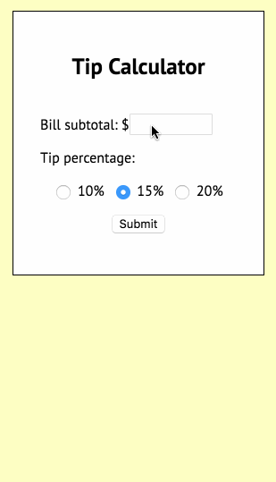
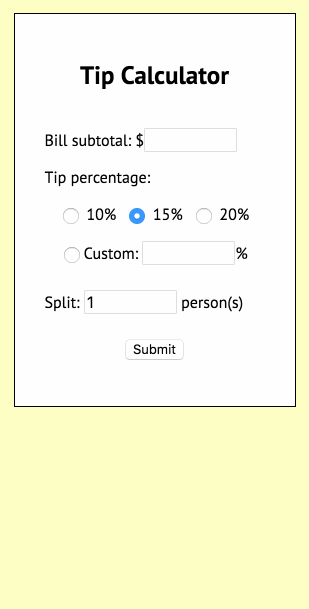

# Pre-work - Tip Calculator

A tip calculator PHP page.

Submitted by: Mateo Garcia

Time spent: 12 hours spent in total

## User Stories

The following **required** functionality is complete:
* [x] User can enter a bill amount, choose a tip percentage, and submit the form to see the tip and total values.
* [x] Tip percentage choices use a PHP loop to output three radio buttons.
* [x] PHP code sets reasonable default values for the form.
* [x] PHP code confirms the presence and correct format of submitted values.
* [x] Page indicates any form errors which need to be fixed.
* [x] Submitted form values are retained when errors or results are shown.

The following **optional** features are implemented:
* [x] Add support for custom tip percentage
* [x] Add support for splitting the tip and total

The following **additional** features are implemented:

* [x] Improved code organization with custom PHP functions.

## Video Walkthrough

Here's a walkthrough of implemented user stories:

With the extensions:

GIF created with [LiceCap](http://www.cockos.com/licecap/).

## Notes

* It took some digging to figure out how to dynamically updating the CSS to indicate a user input error.
* Determining when to call error-displaying code took some thinking, using PHP functions for reading POST variables like isset() and empty().
* Re-displaying user-inputted form values when the form was rerendered was a little tricky.

## License

    Copyright [2016] [Mateo Garcia]

    Licensed under the Apache License, Version 2.0 (the "License");
    you may not use this file except in compliance with the License.
    You may obtain a copy of the License at

        http://www.apache.org/licenses/LICENSE-2.0

    Unless required by applicable law or agreed to in writing, software
    distributed under the License is distributed on an "AS IS" BASIS,
    WITHOUT WARRANTIES OR CONDITIONS OF ANY KIND, either express or implied.
    See the License for the specific language governing permissions and
    limitations under the License.
